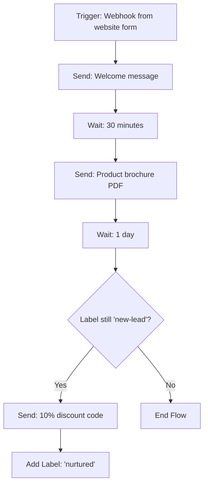

# Automation

Automation lets you build no-code workflows that run when a webhook is called or when a label changes on WhatsApp. It's Wabot's most powerful feature for chaining actions together.

## Where to Find It

Sidebar → **CORE → Automation** — `https://app.wabot.io/dashboard/automation`


## The Automation Dashboard

When you open Automation, you see stats and a list of all your flows:

- **Total Automations** (e.g. `2 / 50 used`)
- **Active** — how many are currently enabled
- **Total Executions** — lifetime run count
- **Contacts Processed**

Filters: **All Status**, **All Triggers**.

The table columns:

- **Automation Name**
- **Trigger** (Label / Webhook)
- **Stats** (runs, actions)
- **Created** date
- **Status** (Active / Inactive)
- **Actions** (edit, duplicate, delete)

---

## Creating an Automation

Click **Create** at the top right to go to `/dashboard/automation/new`. The form has three sections:


### 1. Basic Information

- **Automation Name \*** — e.g. "Welcome New Lead"
- **Description** — internal notes
- **Account Type:**
  - **Unofficial API**
  - **Official API**
- **WhatsApp Account \*** — pick from the dropdown
- **Status** — Enable or disable

### 2. Trigger Type

Choose one:

import Tabs from '@theme/Tabs';
import TabItem from '@theme/TabItem';

<Tabs>
<TabItem value="webhook" label="Webhook" default>

**Use case:** Triggered by external webhook calls from forms, CRM, e-commerce platforms, custom apps.

- The webhook URL is generated **after** you create the automation
- You can then paste it into Google Forms, Stripe, Typeform, Formidable, etc.
- External systems `POST` data to this URL to trigger a new run

</TabItem>
<TabItem value="label" label="Label">

**Use case:** Triggered when a label is added or removed from a contact on WhatsApp.

- Pick a label name (e.g. `new-lead`, `vip`)
- Choose trigger direction: **on add**, **on remove**, or both
- Every time that label changes on a contact, the automation fires

</TabItem>
</Tabs>

### 3. Advanced Settings

- **Run Once Per Contact** — prevents re-running if the same contact re-triggers
- **Error Handling:**
  - **Skip action with errors** (continue to next action)
  - **Stop automation on error**

Click **Create & Add Actions** — you'll be taken to the flow builder to add actions.

---

## Adding Actions

After creation, you build the flow by adding actions one by one. Common action types:

| Action | What it does |
|--------|--------------|
| **Send Message** | Text, image, video, PDF, voice note |
| **Wait** | Delay X minutes / hours / days |
| **Add Label** | Tag the contact |
| **Remove Label** | Untag the contact |
| **Add to Group** | Add contact to an audience group |
| **Remove from Group** | Remove contact from a group |
| **Update Google Sheet** | Append a row or update existing |
| **Call Webhook** | HTTP POST to an external URL |
| **Condition (If/Else)** | Branch based on contact data |
| **End Flow** | Terminate the automation early |

Arrange actions in sequence. Each action passes context (contact info, trigger payload) to the next.

---

## Example — Lead Nurturing Flow



### Build it in Wabot:

1. Create automation with **Webhook** trigger, name it "Lead Nurturing".
2. Copy the generated webhook URL.
3. In your website form or Zapier, configure a POST to that URL on submit.
4. Add actions:
   - Send Message: "Hi \{name\}, thanks for your interest!"
   - Wait: 30 minutes
   - Send Message (with PDF attachment): "Here's our product brochure."
   - Wait: 1 day
   - Condition: If label = `new-lead`
     - True → Send Message: "Here's 10% off: SAVE10"
     - False → End Flow
   - Add Label: `nurtured`
5. Enable the automation.

---

## Triggering from Anywhere (Webhook)

Once created, the webhook URL looks like:

```
https://app.wabot.io/api/automation/webhook/YOUR_UNIQUE_ID
```

Call it from:

- **A button on your website** (via JavaScript fetch)
- **Zapier / Make / Pabbly** actions
- **A cron job** or scheduled task
- **Stripe webhooks** on payment events
- **Google Forms** via Apps Script
- **Any custom app** that can POST JSON

### Example payload:

```json
{
  "phone": "60123456789",
  "name": "Ahmad",
  "email": "ahmad@example.com",
  "order_id": "1234"
}
```

All fields become available as placeholders in your Send Message actions: `{name}`, `{email}`, `{order_id}`, etc.

---

## Monitoring Runs

Click an automation to see:

- **Run history** — every execution with timestamp, contact, status
- **Errors** — failed runs and why
- **Scheduled** — upcoming delayed actions
- **Live feed** — see actions happen in real time

Use this to debug flows and ensure nothing fires silently.

---

## Best Practices

- Keep flows small and focused — one outcome per automation
- Use **Run Once Per Contact** to prevent spam on re-triggers
- Always add an **error-handling** path
- Test with your own number before enabling
- Use **labels** as checkpoints to prevent duplicate nurturing
- Monitor the **Total Executions** and **Contacts Processed** on the list page

---

**See also:** [Webhooks & API](/docs/integrations/webhooks) · [Chatbots](./chatbots) · [Broadcast](./broadcast)
