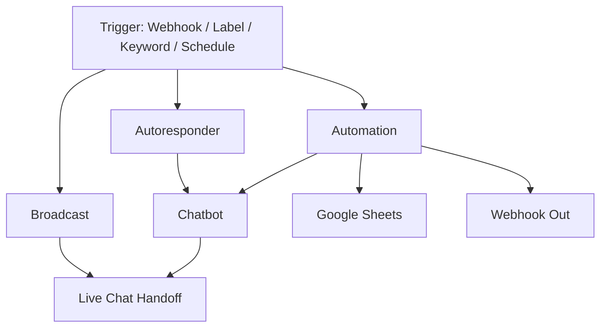

# Core Features

Wabot bundles seven powerful capabilities into one unified dashboard. Each feature is independent but integrates smoothly with the others — you can chain a Chatbot into an Automation, route from an Autoresponder to Live Chat, and broadcast to segments created in Audience.

## The Seven Pillars

- :material-robot: **[Chatbots](chatbots.md)**

    AI-powered bots that answer FAQs, qualify leads, and close sales 24/7.

- :material-bullhorn: **[Broadcast](broadcast.md)**

    Send bulk campaigns to contact groups or segments with scheduling.

- :material-auto-fix: **[Automation](automation.md)**

    Visual workflow builder triggered by webhooks or WhatsApp labels.

- :material-reply-all: **[Autoresponder](autoresponder.md)**

    Keyword-based auto-replies for greetings, FAQs, and quick support.

- :material-chat: **[Live Chat](live-chat.md)**

    Shared team inbox with filters: All, Unread, Widget, Chatbot Active/Inactive, Archived.

- :material-file-document-multiple: **[Templates](templates.md)**

    Reusable message components: pre-approved, lists, buttons, polls, sequences, quick replies.

## Choosing the Right Feature

| I want to... | Use this feature |
|--------------|------------------|
| Send a promotion to 500 contacts | **Broadcast** |
| Reply automatically to "harga" keyword | **Autoresponder** |
| Use AI to answer pricing questions | **Chatbots** |
| Trigger a message when a form is submitted | **Automation** (webhook trigger) |
| Follow up when a WhatsApp label changes | **Automation** (label trigger) |
| Let my team reply to customers together | **Live Chat** |
| Reuse pre-approved WABA message templates | **Templates → Pre-Approved** |
| Save canned responses for quick replies | **Templates → Quick Replies** |
| Send an interactive list of options | **Templates → Lists** |
| Send a button menu | **Templates → Buttons** |

---

## How Features Connect

Click any feature in the sidebar to dive deeper.
